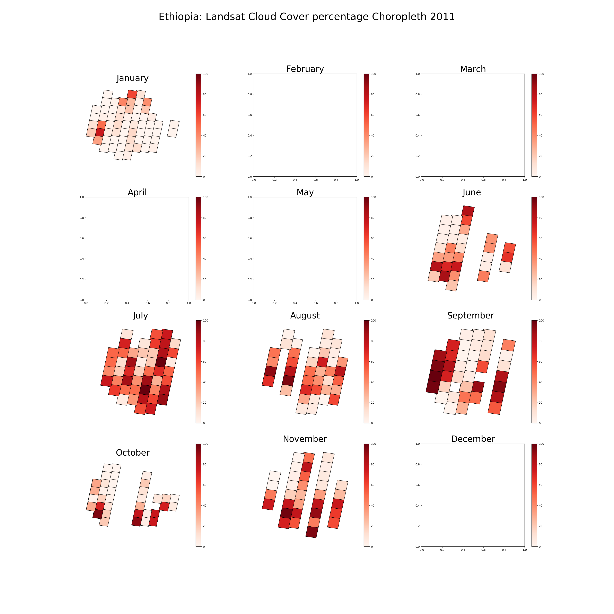
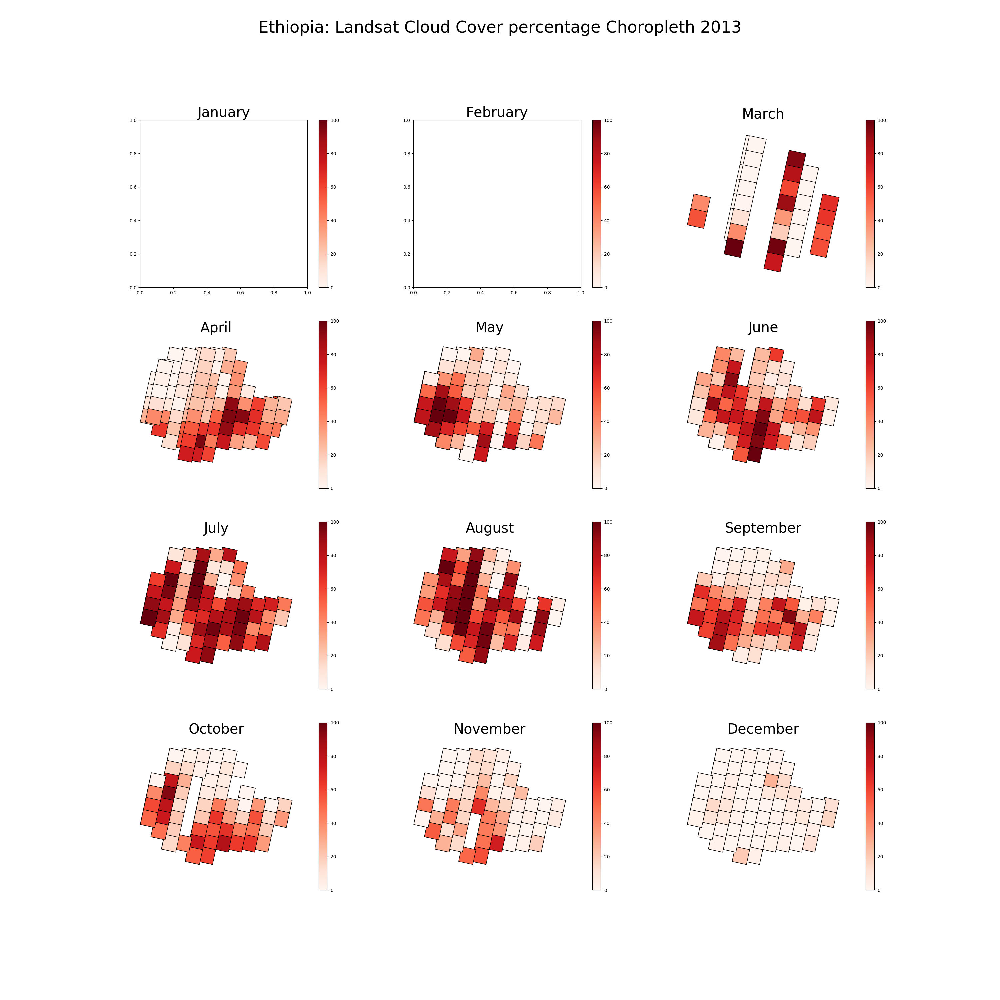

# Choropleth of Cloud Cover Percentage of Ethiopia

These choropleth visualizes the monthly mean cloud cover percentage in hue color, of Sentinel, Landsat 6, Landsat 7, Landsat 8 for each year since the satellite mission started to acquire data. 

`Cloud-Coverage-analysis.ipynb` : a simple jupyter notebook code that explain how the choropleth map is created using the metadata acquired from [USGS website](https://earthexplorer.usgs.gov/)

## Sentinel 

## Landsat-6

## Landsat-7

## Landsat-8

> For more images, go the the image folder
